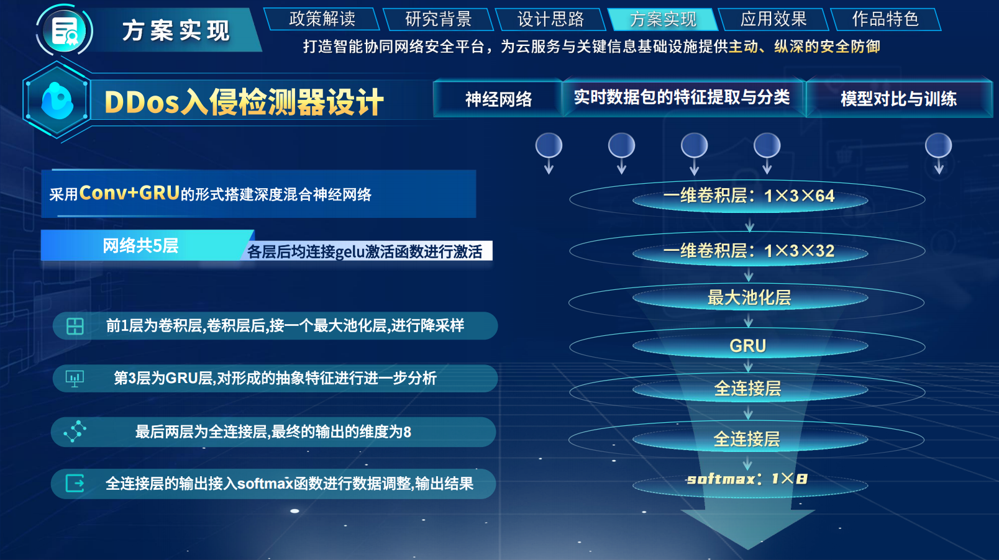
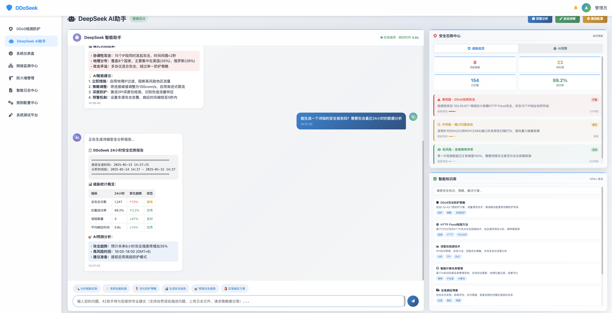
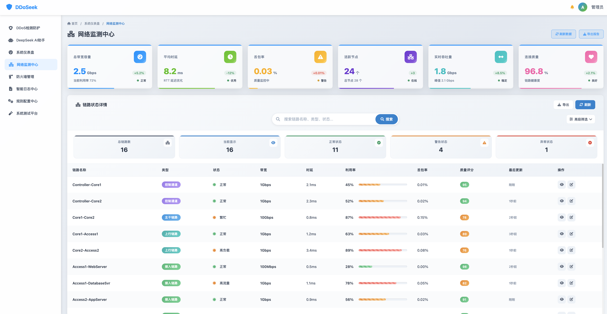
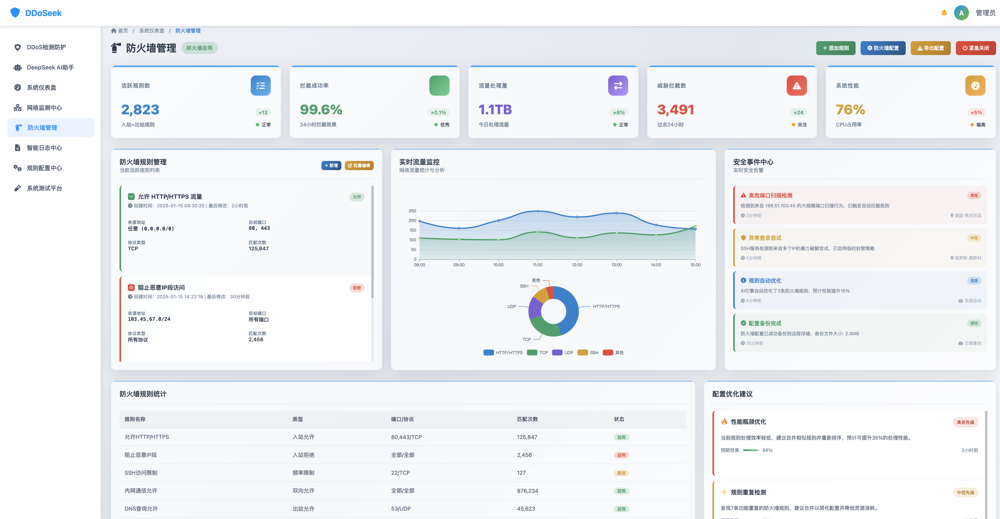
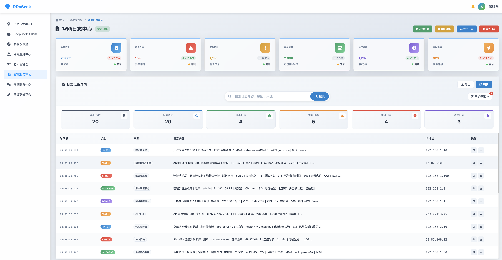

# DDoSeek 智能DDoS检测防护系统


## 📚 目录导航

- [项目简介](#项目简介)
- [系统架构](#系统架构)
  - [技术体系](#技术体系)
  - [技术栈全景](#技术栈全景)
- [应用场景](#应用场景)
  - [企业级 DDoS 防护](#企业级-ddos-防护)
  - [中小企业安全防护](#中小企业安全防护)
  - [云服务提供商](#云服务提供商)
  - [网络安全运营中心](#网络安全运营中心)
- [系统功能](#系统功能)
  - [DDoS 主动防御全球看板](#ddos-主动防御全球看板)
  - [DeepSeek AI 智能助手](#deepseek-ai-智能助手)
  - [智能监控管理中心](#智能监控管理中心)
  - [防火墙与规则管理](#防火墙与规则管理)
  - [智能日志与测试平台](#智能日志与测试平台)
- [使用说明](#使用说明)
  - [快速启动](#快速启动)
  - [快速开始](#快速开始)
  - [开发部署](#开发部署)
- [技术特性](#技术特性)
  - [性能优化](#性能优化)
  - [安全特性](#安全特性)
  - [可扩展性](#可扩展性)
- [版本信息](#版本信息)
- [联系信息](#联系信息)

## 项目简介

DDoSeek 是基于SDN架构与深度学习技术构建的智能DDoS检测防护系统，通过微调DeepSeek模型实现流量特征分析与威胁响应，结合OpenFlow协议实现网络流量动态管控。系统包含SDN防火墙、DDoS入侵检测器、可视化管理平台三大核心模块，已在Mininet仿真环境中完成验证，具备实时检测、动态防御和智能决策能力。

## 系统架构

### 技术体系



系统采用分层架构设计：

- **基础设施层**：基于Mininet的SDN网络仿真环境
- **控制平面**：Ryu控制器实现OpenFlow 1.3协议交互
- **数据处理层**：PyTorch构建的CNN+GRU混合模型
- **应用层**：Django框架开发的Web管理系统

### 技术栈全景

| 组件类型    | 技术选型               |
| ----------- | ---------------------- |
| 前端框架    | HTML5+CSS3+JavaScript  |
| 可视化库    | ECharts/Ant Design     |
| 后端服务    | Python+Flask+Django    |
| SDN控制平面 | Ryu控制器+OpenFlow 1.3 |
| 深度学习    | PyTorch+CNN+GRU        |
| 数据存储    | CSV日志+localStorage   |

## 应用场景

**DDoSeek 为网络安全防护的各个环节提供智能化解决方案**，满足不同规模企业的安全需求，支持高可用、高可扩展、高智能的实战防护部署。

---

### 企业级 DDoS 防护

> 📌 为大型企业提供完整的 DDoS 攻击检测与防护系统，实现网络流量实时监控和智能威胁响应，保障业务连续性和数据安全。

- **多层检测机制**：实现 TCP/UDP/HTTP 全方位防护
- **智能规则引擎**：自动化威胁响应处理
- **攻击流量统计分析**：助力安全决策
- **防护历史追溯**：优化安全策略


---

### 中小企业安全防护

> 📌 为中小企业提供轻量化的网络安全防护工具，快速部署 DDoS 防护和防火墙管理，降低安全运维成本，提升网络安全水平。

- **威胁快速检测**：实时确认攻击类型
- **一键部署功能**：快速启用安全防护
- **攻击历史记录**：便于安全分析追溯
- **智能规则推荐**：保护业务数据


---

### 云服务提供商

> 📌 为云服务提供商提供专业的安全防护解决方案，保护云基础设施和客户数据，提升服务可靠性和客户信任度。

- **多租户安全隔离**：杜绝数据泄露风险
- **API 接口集成**：方便业务系统对接
- **弹性扩展能力**：自适应业务增长
- **安全事件监控**：实时了解防护状态


---

### 网络安全运营中心

> 📌 为网络安全运营中心提供集中化监控管理工具，统一管理多个客户的安全防护，提高安全运营效率和响应速度。

- **全局威胁监控**：及时发现安全异常
- **客户端管理功能**：确保服务质量
- **事件处理机制**：快速响应安全事件
- **安全数据分析**：优化防护策略


## 系统功能

 **DDoSeek 提供全方位的网络安全防护功能模块**，从全球态势感知到 AI 智能分析，构建完整的安全防护体系，助您应对复杂多变的网络威胁。

---

### DDoS 主动防御全球看板

> 📌 通过动态 3D 地球模型直观展示全球攻击路径与来源，实时呈现恶意流量、攻击类型、系统防护性能等核心数据，打造全局态势一目了然的可视化体验。

✅ **动态 3D 地球模型**：可视化全球攻击路径
✅ **实时恶意流量统计**：多维度攻击类型分析
✅ **系统防护性能监控**：性能指标与目标排行
✅ **态势感知与威胁预警**：即时预警机制支持


---

### DeepSeek AI 智能助手

> 📌 集成微调版 DeepSeek 大模型，融合 RAG 专家知识库，提供 7×24 小时的安全态势咨询、预测分析与决策支持，提升应对未知威胁的智能化水平。

✅ **全天候威胁分析**：生成安全态势简报
✅ **趋势预测能力**：识别未来高风险时段
✅ **专业知识增强**：基于 RAG 的策略建议
✅ **智能对话交互**：定制化防护方案生成



---

### 智能监控管理中心

> 📌 核心仪表盘整合实时检测、KPI 指标、链路健康与历史性能数据，构建全景式网络状态画像，辅助网络管理员快速定位与响应。

✅ **实时威胁检测**：秒级响应机制保障
✅ **KPI 指标展示**：可视化链路状态评估
✅ **运行状态感知**：多维组件监控与告警
✅ **历史对比分析**：智能搜索与性能回溯



---

### 防火墙与规则管理

> 📌 面向规则配置与策略管理，提供图形化编辑器、分类管理机制、模板与版本控制，提升防火墙配置的灵活性和准确性。

✅ **防火墙总览仪表盘**：规则统计一目了然
✅ **可视化规则编辑器**：支持分组与高亮语法
✅ **高级规则配置**：内置 JS 模板库快速上手
✅ **验证与版本管理**：多版本切换与安全测试



---

### 智能日志与测试平台

> 📌 从日志洞察到安全评估，系统支持多种攻击模拟与实时数据分析，构建完整的安全测试与可视化分析流程。

✅ **实时日志采集分析**：结合 ECharts 图表可视化
✅ **AI 洞察轮播系统**：快速发现异常模式
✅ **攻击模拟测试平台**：支持 HTTP/TCP 等多场景
✅ **防护评估与压力测试**：全方位性能对比



## 使用说明

### 快速启动

```bash
# 前端部署
cd DDoSeek-Frontend
npm install
npm start

# 后端服务
cd DDoSeek-Backend
pip install -r requirements.txt
python app.py

# SDN环境初始化
sudo mn --controller=remote,ip=127.0.0.1:6633 --switch ovsk --topo tree,depth=2,fanout=2
```

### 快速开始

1. **登录系统**

   - 访问 `login.html`
   - 使用默认账户：用户名 `admin`，密码 `admin123`
   - 可选择"记住我"功能
2. **导航使用**

   - 点击侧边栏菜单进行页面切换
   - 使用键盘快捷键快速导航
   - 点击面包屑导航快速返回
3. **系统功能**

   - 仪表盘：查看系统概览和实时数据
   - 网络监测：监控网络状态和拓扑结构
   - DDoS防护：配置和管理威胁防护策略
   - 防火墙：管理访问控制规则
   - 日志中心：查看和分析系统日志
   - AI助手：获得智能分析和建议
   - 规则配置：编辑和管理安全规则
   - 系统测试：进行系统性能和安全测试

### 开发部署

1. **文件结构**

   ```
   DDoSeek/
   ├── backend
   │ └── tbs2
   │ ├── .idea
   │ ├── dataset
   │ ├── SDN-Firewall
   │ └── web_admin
   ├── frontend
   │ ├── public
   │ ├── dashboard.html # 系统仪表盘
   │ ├── ddos-detection.html # DDoS 检测防护
   │ ├── deepseek-assistant.html # DeepSeek AI 助手
   │ ├── firewall-management.html # 防火墙管理
   │ ├── log-center.html # 智能日志中心
   │ ├── login.html # 登录页面
   │ ├── network-monitor.html # 网络监测中心
   │ ├── router.js # 路由管理器
   │ ├── rule-config.html # 规则配置中心
   │ ├── system-test.html # 系统测试平台
   │ └── index.html
   ├── .github
   └── README.md # 说明文档              # 说明文档
   ```
2. **部署要求**

   - 现代Web浏览器（Chrome 80+, Firefox 75+, Safari 13+）
   - HTTP/HTTPS服务器（推荐Nginx或Apache）
   - 支持JavaScript ES6+语法
3. **配置说明**

   - 所有页面都引用 `router.js` 进行路由管理
   - 使用localStorage进行状态持久化
   - CDN资源包括FontAwesome和ECharts

## 技术特性

### 性能优化

- **懒加载**: 图表和数据按需加载
- **资源复用**: 共享的CSS和JavaScript组件
- **缓存策略**: 合理的localStorage使用
- **响应式图表**: 自动适配屏幕尺寸

### 安全特性

- **身份验证**: 完整的登录/登出流程
- **会话管理**: 自动过期和状态检查
- **输入验证**: 表单数据验证和清理
- **XSS防护**: 安全的DOM操作

### 可扩展性

- **模块化设计**: 组件化的页面结构
- **统一API**: 一致的数据接口设计
- **插件架构**: 易于添加新功能模块
- **主题系统**: 支持自定义主题和样式

## 版本信息

- **当前版本**: v2.1.0
- **发布日期**: 2025年
- **开发状态**: 生产就绪
- **维护状态**: 持续更新

## 联系信息

- **项目名称**: DDoSeek 智能DDoS检测防护系统
- **技术支持**: 专业的DDoS检测防护解决方案
- **文档更新**: 随系统版本同步更新

---

*本文档详细介绍了DDoSeek系统的完整路由功能和使用说明。如有疑问，请参考各页面的内置帮助系统或联系技术支持。*
